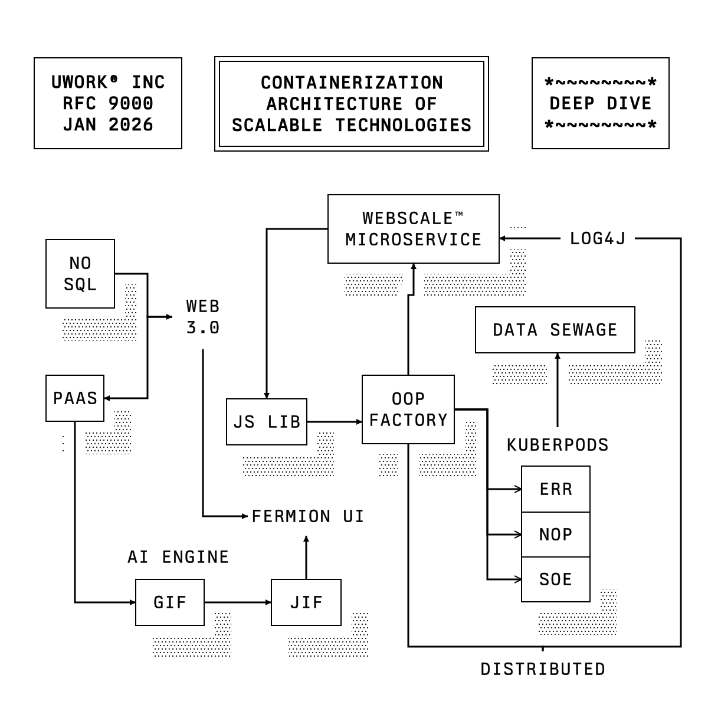

# Reference comparison and adversarial review

| [Reference print](https://usgraphics.com/static/products/TX-02/images/TX-02-box-drawing.541f94d73270.svg) | [Editor export](docs/editor-preview.svg) |
| --- | --- |
|  |  |

The images were compared at the same 600 × 600 artboard size. The editor's actual SVG export was rasterized for the preview above. The starter composition traces 20 editable labels and boxes plus 16 directional routes from the reference. It retains the three header boxes, main component positions, monochrome lines, mixed filled/open arrowheads, and staggered dot shadows.

## What still differs

- The reference encodes all lettering as custom black paths. The editor now uses the locally installed Berkeley Mono family for editable SVG text. Other machines need that font installed to render the export the same way.
- The reference's dotted shadows and route offsets vary by component. The editor uses a repeatable halftone pattern and traced routes for the starter. New diagrams use ELK; edits to the starter preserve placed nodes and reroute changed arrows around them.
- A label edit that fits its existing starter box retains the traced composition. Larger labels grow their box and reroute affected arrows. New connections also preserve the placed blocks.

## Adversarial checks

- The original five-block starter failed the visual comparison because it left most of the page empty. The 20-block reference composition replaces it.
- The earlier green rounded renderer failed the print style comparison. The export now uses black square/double outlines, uppercase labels, white background, right-angle arrows, and halftone shadows.
- White backing shapes and arrow underlays reproduce the clear channel around black strokes. Their clearance is three times the initial setting. Text edits happen inline on the canvas; connection dots show on hover and hide while editing.
- An overlap check verifies that the traced routes do not pass through unrelated node bounds. The ELK check covers a branched diagram; an additional 35 generated graphs with 315 edges had no segment crossing an unrelated node.
- A DOM interaction test covers editing text, border thickness, shadow visibility, directional linking, and exported SVG content. The production build succeeds.
- The in-app browser was unavailable, so visual comparison was performed on the real SVG export through a vector rasterizer. Live pointer interaction remains unverified in a browser.
